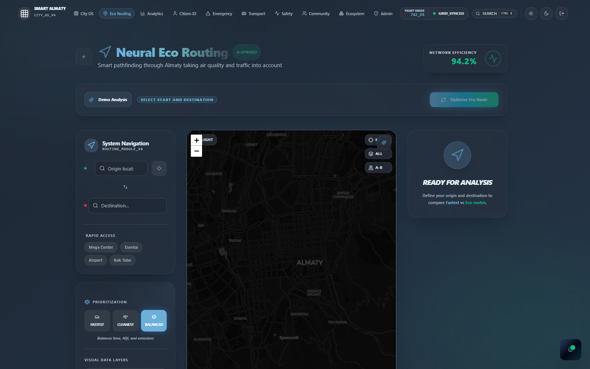
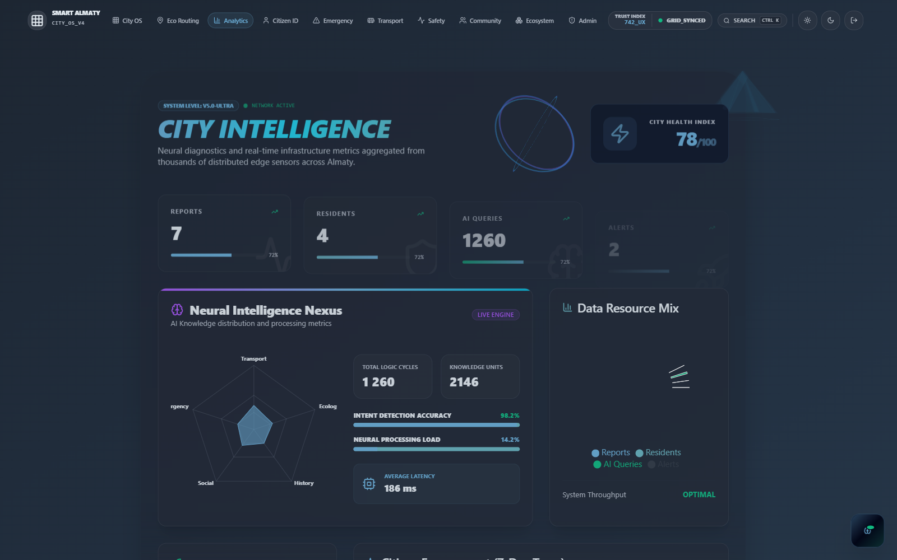
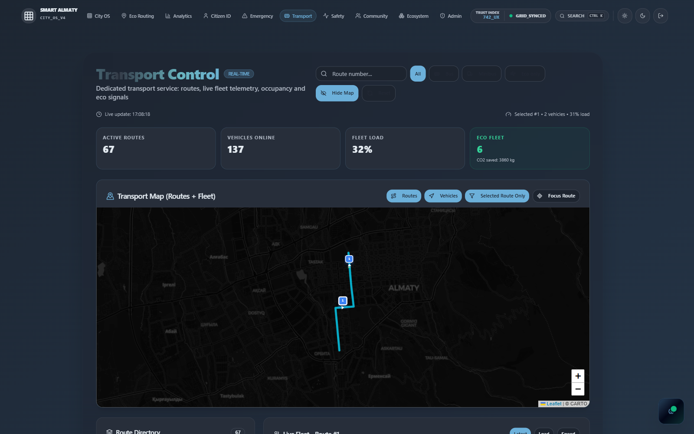
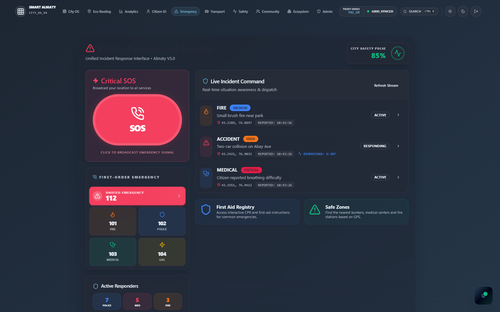
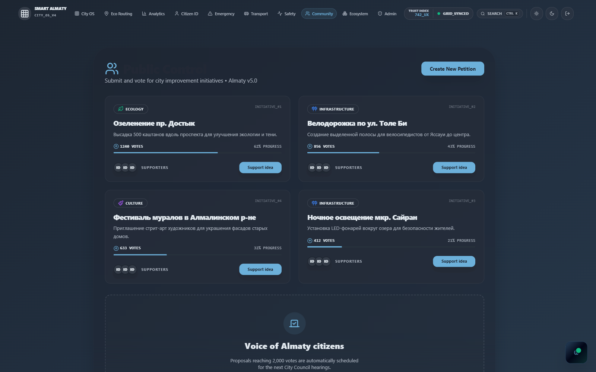
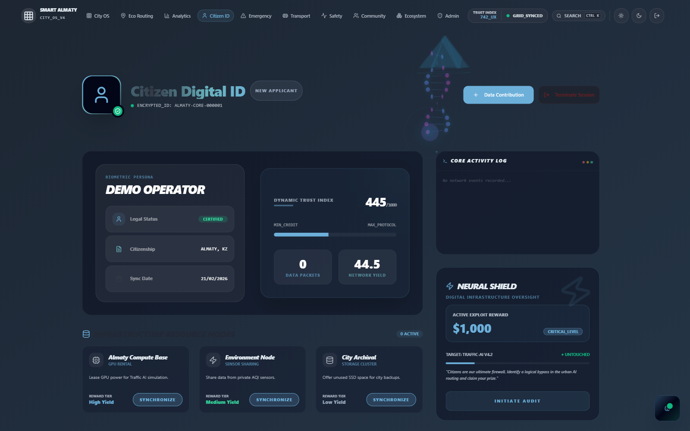
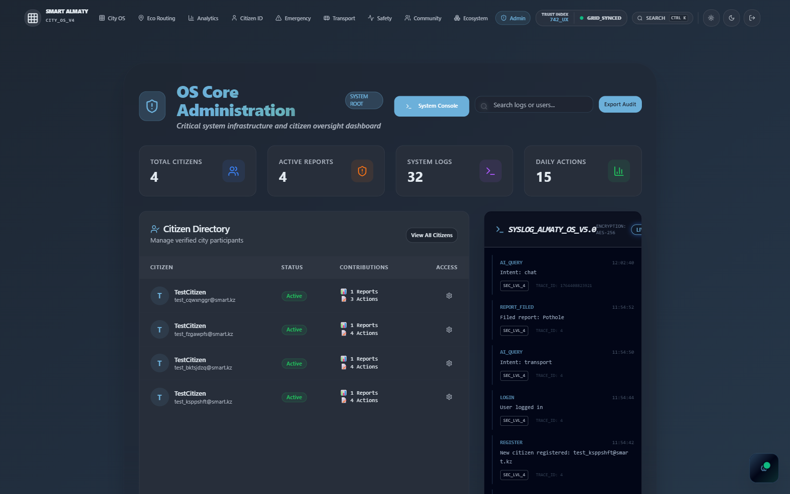
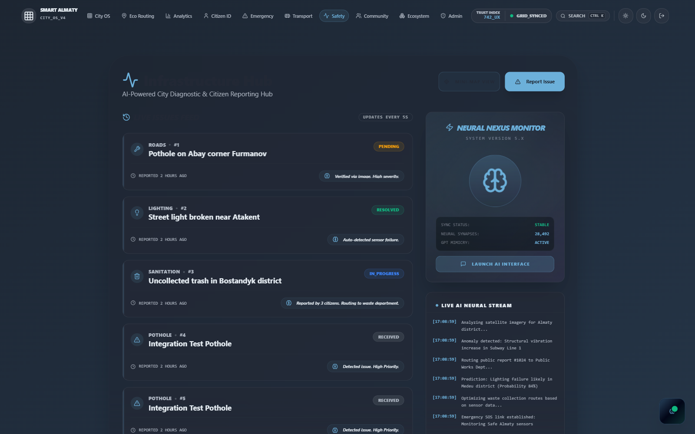
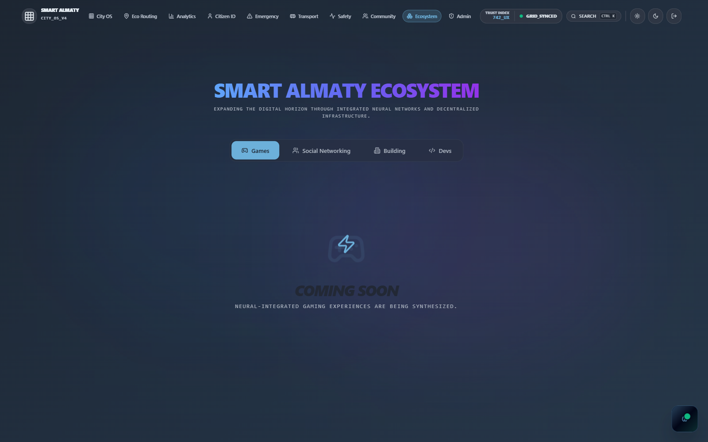

# Smart City Almaty

Smart City Almaty is a full-stack urban platform for digital city services: AI assistant, eco-routing, public transport monitoring, emergency coordination, citizen reports, petitions, and social/messenger features.

## Project Goals
- Deliver a working end-to-end user flow: `UI -> API -> data -> UI`.
- Provide city-level services through one unified platform.
- Keep engineering quality measurable via lint/build/API/e2e gates.

## Tech Stack
- Frontend: `React 18`, `TypeScript`, `Vite`, `TanStack Query`, `Leaflet`, `Three.js`.
- Backend: `Python`, `FastAPI`, `SQLAlchemy`, `Uvicorn`.
- Data/API: REST API on `http://localhost:8000/api`.
- Auth: backend auth endpoints (`/api/auth/*`).
- Testing: backend tests + Playwright e2e (`tests/e2e`).

## Core Functional Modules
- AI Assistant
  AI analysis endpoint with context-aware responses, proactive recommendations, vision/voice utilities, and conversation controls.
- Eco Routing v2
  Smart route scoring with traffic, AQI exposure, CO2 estimation, fallback modes, caching, health checks.
- Transport Intelligence
  Live/seeded buses, route metadata, traffic and eco transport stats.
- Emergency Services
  SOS creation, active incidents, and emergency unit tracking.
- Public Governance
  Citizen reports, petitions, city feed, and contribution metrics.
- Messenger / Social Layer
  Chats, messages, contacts, profile updates, media upload, stickers.
- Admin Panel APIs
  User list, activity logs, operational visibility.

## Service Map (Backend API)
Main service groups:
- Auth: `/api/auth/register`, `/api/auth/login`
- AI: `/api/ai/analyze`, `/api/ai/proactive`, `/api/ai/forecast`, `/api/ai/vision*`, `/api/ai/voice/*`
- Reports & Community: `/api/reports`, `/api/petitions`, `/api/city/feed`
- Transport: `/api/transport/traffic`, `/api/transport/buses`, `/api/transport/routes`, `/api/transport/eco-stats`
- Emergency: `/api/emergency/status`, `/api/emergency/units`, `/api/emergency/incidents`, `/api/emergency/sos`
- Sensors & Analytics: `/api/sensors/qa`, `/api/timeseries/{sensor_type}`, `/api/stats`
- Routing v2 module: `/api/routing/eco`, `/api/routing/config`, `/api/routing/health`
- Messenger: `/api/messenger/chats`, `/api/messenger/contacts`, `/api/messenger/profile/*`, `/api/messenger/upload`, `/api/messenger/stickers`
- Admin: `/api/admin/users`, `/api/admin/logs`
- Health: `/api/health`

## Frontend Routes
- `/` Smart City Dashboard
- `/auth` Authentication
- `/eco-routing` Eco Routing
- `/transport` Public Transport
- `/emergency` Emergency Services
- `/community` Public Control
- `/analytics` Analytics
- `/profile` User Profile
- `/admin` Admin Panel
- `/infrastructure`, `/ecosystem`, `/docs`

## Quick Start (Windows)
Run both backend and frontend:

```bat
start_dev.bat
```

## Manual Local Run
### Prerequisites
- Node.js 18+
- npm
- Python 3.10+
- pip

### 1) Backend (FastAPI)
```bat
cd backend
pip install -r requirements.txt
python main.py
```

Backend URL: `http://localhost:8000`

### 2) Frontend (Vite)
```bat
npm install
npm run dev
```

Frontend URL: `http://localhost:5173`

## Environment Variables
Frontend (`.env`):
- `VITE_API_BASE_URL`
- `VITE_USE_MOCK_DATA`

Backend optional AI data/training variables:
- `ENABLE_INTERNET_SEARCH`
- `EXTERNAL_SITE_URLS`
- `EXTERNAL_SITE_MAX_PAGES`
- `EXTERNAL_SITE_MAX_RECORDS`
- `EXTERNAL_DATA_DIR`
- `EXTERNAL_SMART_CITY_FILE`
- `EXTERNAL_CHAT_FILE`
- `TRAIN_EPOCHS`
- `TRAIN_TARGET_SIZE`
- `TRAIN_BATCH_SIZE`
- `TRAIN_LR`
- `EXTERNAL_LIMIT_PER_FILE`

## Quality Gates
From project root:

```bat
npm run lint
npm run build
curl http://localhost:8000/api/reports
cd backend && python test_integration.py
npm run test:e2e
```

## Pages & Screenshots
### 1) Dashboard (`/`)
Central city operations view: map overview, city status, AI highlights, and quick actions.


### 2) Eco Routing (`/eco-routing`)
Green route planning with route alternatives and sustainability-oriented routing logic.



### 3) Analytics (`/analytics`)
Urban analytics and monitoring KPIs for city services and performance trends.



### 4) Public Transport (`/transport`)
Transport operations page: route and fleet visibility for buses/public mobility.



### 5) Emergency (`/emergency`)
Emergency coordination panel with incidents and operational response context.



### 6) Community (`/community`)
Citizen interaction area for public control, participation, and social feedback.



### 7) Profile (`/profile`)
Citizen profile and personal activity/identity section.



### 8) Admin (`/admin`)
Administrative dashboard with user management and system-level controls.



### 9) Infrastructure (`/infrastructure`)
Infrastructure and safety monitoring views for city assets and health indicators.



### 10) Ecosystem (`/ecosystem`)
Broader city ecosystem module integrating connected platform domains.



## Project Structure
```text
smart-city-almaty-main/
  backend/          # FastAPI + SQLAlchemy + AI engines + routing module
  src/              # React app (pages, components, hooks, contexts, lib)
  public/           # Static assets and visuals
  tests/e2e/        # Playwright scenarios
  start_dev.bat     # One-command local startup
```

## Current Status
- Full-stack platform with multiple city service domains is implemented.
- API and UI cover auth, AI, routing, transport, emergency, governance, and messenger flows.
- Quality gate commands are integrated into the workflow for release readiness.
